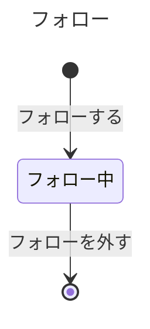

# フォローの業務知識

X のクローンで、利用者が誰をフォローしてよいか、いつフォローを外せるか、いま誰をフォロー中かを、業務を知る人と作り手が同じ言葉で判断するための業務知識である。フォローは、利用者が別の利用者をフォローしたときに始まり、そのフォローを外したときに終わる。フォローする相手を探す一覧と、本人がいまフォロー中の相手を知ることもこの業務に含む。

# 概要

フォローは、利用者が読みたい相手を自分で選び、その選択を一人ずつの約束として持ち続ける業務である。利用者は、存在する別の利用者をフォローし、要らなくなったら外す。一人がフォロー中にできる相手は5,000人までで、同じ相手を二重にフォローすることも、自分をフォローすることもない。選んだ相手がそろっていることと、選ばなかった相手が混ざらないことが、この業務が守る価値である。ホームタイムラインは「いまフォロー中の相手」を読んで表示対象を決めるので、ここが食い違うと、利用者は選んだ相手のポストを見落とすか、選んでいない相手のポストを見せられる。

利用者の登録と、利用者と利用者ID の決め方はアカウントの業務が担う。フォロー中の相手のポストをどこまでホームタイムラインに載せるか（フォローする前のポストも載せること、外した相手のポストを載せないこと）はホームタイムラインの業務が、フォロワーへのポストの配信はポストの業務が担う。ホームタイムラインへの反映の遅れと、フォローとフォローを外す操作の回数の上限は、仕組みを守るための品質の決まりなので、この業務の決まりに入れない（[非機能要件](../../input/非機能要件.md)の「整合性と鮮度」と「負荷保護」に置いた）。非公開アカウント、ブロック、ミュートは初期リリースの対象外である（[バックエンド要件](../../input/バックエンド要件.md)の「初期リリースの対象範囲」）。

# ユビキタス言語

業務の言葉と英名の対応は次のとおりである。利用者と利用者ID はアカウントの業務が決める語で、アカウントの資料がまだ無いので英名を `未定` として空けている。

| 業務の言葉 | 英名 | 種類 | 持ち主 |
|---|---|---|---|
| 利用者 | 未定 | 業務用語 | [アカウントの業務知識](../アカウント/business-knowledge.md) |
| 利用者ID | 未定 | 業務用語 | [アカウントの業務知識](../アカウント/business-knowledge.md) |
| フォロー | Follow | 業務用語 | この資料 |
| フォロワー | Follower | 業務用語 | この資料 |
| フォロー中の相手 | Followee | 業務用語 | この資料 |
| フォロー中の人数 | FollowingCount | 業務用語 | この資料 |
| フォロー上限 | FollowLimit | 業務用語 | この資料 |
| フォローした日時 | FollowedAt | 業務用語 | この資料 |
| フォローを外した日時 | UnfollowedAt | 業務用語 | この資料 |
| 自分との関係 | RelationToMe | 業務用語 | この資料 |
| 本人 | Self | 業務用語 | この資料 |
| フォローしていない | NotFollowing | 業務用語 | この資料 |
| フォローした | Followed | 業務イベント | この資料 |
| フォローを外した | Unfollowed | 業務イベント | この資料 |
| フォロー中 | Following | 状態 | この資料 |
| フォローする | FollowUser | コマンド | この資料 |
| フォローを外す | UnfollowUser | コマンド | この資料 |
| フォロー中の相手を知る | FindFollowees | クエリ | この資料 |
| フォローする相手を探す | FindUsersToFollow | クエリ | この資料 |

この資料が決めた英名は、業務の言葉を英語にした仮の名前である。業務の人が別の呼び方を使っていれば、「まだ決まっていないこと」に従って直す。

## 業務用語

### フォロー

一人の利用者が別の利用者一人を選び、その相手を読むと決めた約束である。フォローしたときに始まり、フォローを外したときに終わる。同じ二人の間でも、外した後にもう一度フォローしたら、前とは別の新しいフォローになる。

### フォロワー

フォローをした側の利用者である。相手の側から見て「この人は自分をフォローしている」と言うときの呼び方で、フォローの向きを取り違えないために使う。

### フォロー中の相手

一人の利用者が、いまフォロー中のフォローを持っている相手の利用者である。外した相手は含まない。ホームタイムラインの業務が表示対象を決めるときに読むのは、この相手の集まりである。

### フォロー中の人数

一人の利用者の、フォロー中のフォローの数である。フォローしてよいかをフォロー上限と比べて決めるときに使う。外したフォローは数えない。

### フォロー上限

一人の利用者が同時にフォロー中にできる相手の人数の上限で、5,000人である（[バックエンド要件](../../input/バックエンド要件.md)の「フォローできる」）。外したフォローは上限に数えないので、上限に達していても一人外せば、また一人フォローできる。

### フォローした日時とフォローを外した日時

フォローした日時は、利用者がフォローしたことを受け付けた日時で、フォローを外した日時は、そのフォローを外したことを受け付けた日時である。後から「いつフォローし、いつ外したか」を説明するときに使う。

### 自分との関係

フォローする相手を探す一覧で、見ている利用者から見た、一覧の一人ひとりとの関係である。本人、フォロー中、フォローしていないのどれか一つになる。

### 本人

自分との関係のうち、一覧の一人が見ている利用者自身であることを表す。本人はフォローできない相手なので、フォローしていない相手と区別して見せる。

### フォローしていない

自分との関係のうち、見ている利用者が、その相手へのフォロー中のフォローを持っていないことを表す。一度もフォローしたことが無い相手も、フォローを外した相手も、同じくフォローしていないである。

## 業務イベント

### フォローした

利用者が別の利用者をフォローした。フォロー中のフォローが一件生まれ、その相手はフォロー中の相手に加わり、フォロー中の人数が一人増える。

### フォローを外した

利用者がフォロー中の相手のフォローを外した。そのフォローは終わり、相手はフォロー中の相手から外れ、フォロー中の人数が一人減る。

# 概念

## フォロー

フォローは、フォロワーと、フォローされる相手の二人の間の、向きのある約束である。A が B をフォローしていても、B が A をフォローしていることにはならない。約束の中身は「誰が誰を読むと選んだか」だけで、読む範囲（フォローする前のポストも読むか）はホームタイムラインの業務が決める。

利用者は退会できないので（本人退会と強制退会は初期リリースの対象外）、一度存在した利用者はいなくならない。だから、フォロー中の相手がいなくなってフォローが宙に浮くことは、初期リリースでは起きない。

## フォロー中の相手

フォロー中の相手は、一件のフォローの中には無く、一人の利用者のフォロー中のフォローをすべて見て初めて分かる。フォローしてよいか（すでにフォローしていないか、フォロー上限に達していないか）も、フォローを外せるかも、この集まりで決まる。

# 常に守られること

### 一人の利用者は、同じ相手へのフォロー中のフォローを一件しか持たない

同じ相手を二重にフォローできると、一度外しても、まだフォロー中のフォローが残り、利用者は外したはずの相手のポストを見せられ続ける。フォロー中の人数も実際の相手の数より多くなり、フォロー上限に早く届いてしまう。

### 一人の利用者のフォロー中のフォローは、5,000件を超えない

上限は、一人の利用者が読むと選べる相手の数を区切るためにある。超えて通ると、上限を理由に拒んだほかの利用者との扱いが食い違い、決まりとして説明できなくなる。

### 自分自身へのフォローは無い

自分は自分のポストをすでに読んでいる（ホームタイムラインは自分のポストを載せる）。自分をフォローできると、フォロー中の人数が相手のいないフォローで増え、一覧で本人とフォロー中を区別できなくなる。

### いまフォロー中の相手は、成立した「フォローした」と「フォローを外した」の順から一つに決まる

ある相手について、最後に成立したのが「フォローした」ならフォロー中で、「フォローを外した」か、何も成立していなければフォローしていない。いまのフォロー中の相手と、成立した事実の片方だけが変わっていると、ホームタイムラインが読む相手と、後から説明する事実が食い違い、どちらが正しいかを誰も決められなくなる。

### 誰がいつ誰をフォローし、いつ外したかを、成立した順に後から説明できる

サービスを運用する開発チームは、利用者から「この人をいつフォローしたか」「外したはずなのに、なぜまだ見えていたのか」と問われたときに、その二人の間で成立した「フォローした」と「フォローを外した」を、フォローした日時とフォローを外した日時と一緒に、成立した順に示して答える。障害の後には、いまのフォロー中の相手が成立した事実の順と合っているかを、同じ事実で確かめる。拒んだフォローとフォローを外す行いは、成立した事実として残さない。成立した事実は後から変わらない。説明できなければ、利用者の問い合わせにも、回復が正しいかにも答えられない。

# 状態と、その移り変わり

## フォローは、外すと終わり、外した後の状態を持たない



フォローを外すとそのフォローは終わり、戻ることもない。同じ相手をもう一度フォローしたら、別の新しいフォローがフォロー中で始まる。外した後のフォローで業務が判断することは無いので、外した後の状態には名前を付けない。「フォローしていない」は一覧で見せる自分との関係で、フォローの状態ではない。

# 業務の行い

## コマンド

### フォローする

利用者本人だけが、自分のフォローとしてフォローできる。誰を読むかは本人が選ぶことなので、別の利用者が本人の代わりにフォローすると、本人は選んでいない相手のポストを見せられ、フォロー上限も本人の知らないうちに使われる。利用者として登録していない人は利用者として業務に登場しないので、フォローできない（利用者の登録はアカウントの業務）。

フォローできるのは、相手が存在する利用者で、自分自身ではなく、その相手をいまフォロー中ではなく、自分のフォロー中の人数がフォロー上限の5,000人未満のときである。4,999人をフォロー中なら5,000人目をフォローでき、5,000人をフォロー中なら次の一人はフォローできない。フォローすると、フォロー中のフォローが一件生まれ、「フォローした」が起きる。フォローした日時は、フォローを受け付けた日時である。フォローを外した相手をもう一度フォローしたときも、同じ条件で判断し、新しいフォローが生まれる。

#### 拒む理由: 別の利用者としてフォローする

誰を読むかを選べるのは本人だけである。別の利用者として通すと、本人が選んでいない相手がフォロー中の相手に加わり、本人のフォロー上限も知らないうちに減る。

#### 拒む理由: 自分自身をフォローする

自分のポストは、フォローしなくても自分のホームタイムラインに載る。自分へのフォローは読む相手を増やさず、フォロー中の人数だけを増やす。

#### 拒む理由: 存在しない利用者をフォローする

いない相手を読むと選んでも、読むポストは生まれない。相手のいないフォローがフォロー中の人数を使い、後から誰をフォローしたかも説明できなくなる。

#### 拒む理由: すでにフォローしている利用者をフォローする

同じ相手へのフォロー中のフォローは一件だけである。二件目を通すと、一度外してもまだフォロー中のフォローが残る。

#### 拒む理由: フォロー上限に達している利用者がフォローする

一人がフォロー中にできる相手は5,000人までである。超えて通すと、上限で拒んだほかの利用者との扱いが食い違う。

### フォローを外す

利用者本人だけが、自分のフォローを外せる。別の利用者が本人のフォローを外すと、本人は読むと選んだ相手のポストを知らないうちに見られなくなる。

外せるのは、本人がいまフォロー中の相手へのフォローだけである。外すと、そのフォローは終わり、「フォローを外した」が起きる。フォローを外した日時は、外すことを受け付けた日時である。外した後、その相手はフォローしていない相手になり、フォロー中の人数は一人減る。

#### 拒む理由: 別の利用者としてフォローを外す

誰を読むのをやめるかを選べるのは本人だけである。別の利用者として通すと、本人が選んだ相手が知らないうちにフォロー中の相手から外れる。

#### 拒む理由: フォローしていない相手のフォローを外す

外すフォローが無い。通すと、成立していないフォローが終わったという事実が残り、後から説明する順が食い違う。拒んでも、フォロー中の相手は何も変わらない。

## クエリ

### フォロー中の相手を知る

利用者本人だけが、自分のフォロー中の相手を知れる。本人のホームタイムラインに何を載せるかをホームタイムラインの業務が決めるときも、その本人のフォロー中の相手を読む。初期リリースは、他者が誰をフォローしているかを見せる約束をしていない。

見せるのは、本人がいまフォロー中の相手全員の利用者ID である。フォローを外した相手は含めない。フォロー中の相手が一人もいなければ、何も見えないのが正しい結果である。見せる相手はひとまとまりで、一人でも欠けるとホームタイムラインの表示対象が変わるので、全員がそろっていることが決まりである。並び順は、どの相手がフォロー中かを変えないので持たない。

#### 拒む理由: 別の利用者のフォロー中の相手を知る

フォロー関係は、本人が選び、本人が扱うものである。初期リリースは他者のフォロー中の相手を見せる約束をしていないので、見せると本人が公開していない選択が漏れる。

### フォローする相手を探す

利用者なら誰でも、フォローする相手を探すために行える。見る人ごとに自分との関係が違うので、見るのは常に自分から見た一覧である。

見せるのは、登録済みの利用者全員で、見ている本人も含む。非公開アカウントとブロックを扱わないので、一覧から除く利用者はいない。一人ひとりについて、利用者ID と、見ている利用者から見た自分との関係（本人、フォロー中、フォローしていない）を見せる。並びは利用者ID の小さい順である。一覧を分けて見せるときは、続きを、直前に見せた最後の利用者ID より大きい利用者ID から見せるので、前に見せた利用者が続きに再び現れることはない。読み進める間に登録した利用者や、変えたフォローが、先に見せた部分に反映されることはなく、最新の一覧を見るには先頭から見直す。一回に見せる人数は、誰が一覧に入りどの順に並ぶかを変えないので、API の契約に置いた（値は要件に無い）。

# 導出されること

フォロー中の人数は、その利用者のフォロー中のフォローの数である。フォロー中の相手は、その利用者のフォロー中のフォローの相手の集まりである。自分との関係は、一覧の一人が見ている利用者自身なら本人、見ている利用者がその相手をフォロー中の相手に持っていればフォロー中、どちらでもなければフォローしていないである。

# 同時に起きたとき

同じ利用者のフォローとフォローを外す行いが同時に起きたときは、先に受け付けた方から順に、そのときのフォロー中の相手で判断する。後の方は、先の方の結果を前提に通るか拒むかが決まる。受け付けた順に判断すれば、上限と重複の決まりを一人ずつの判断と同じ言葉で説明でき、成立した事実の順とも食い違わない。

### 同時に起きること: フォロー上限の手前で二人を同時にフォローする

4,999人をフォロー中の利用者が二人を同時にフォローしたら、先に受け付けた一人だけがフォロー中になる。後の一人はフォロー上限に達した後に判断されるので拒まれ、フォロー中の人数は5,000人を超えない（BDD-013）。

### 同時に起きること: 同じ相手を同時に二回フォローする

先に受け付けた一回だけがフォローになる。後の一回は、すでにフォローしている相手へのフォローとして拒まれ、同じ相手へのフォロー中のフォローは一件のままである（BDD-014）。

### 同時に起きること: 同じ相手のフォローを同時に二回外す

先に受け付けた一回だけがフォローを外す。後の一回は、フォローしていない相手のフォローを外すこととして拒まれ、「フォローを外した」は一回しか成立しない（BDD-015）。

### 同時に起きること: 同じ相手のフォローを外すのと、もう一度フォローするのが重なる

先に受け付けた方から判断する。フォロー中の相手へのフォローが先に受け付けられたら、すでにフォローしているので拒まれ、その後の外す行いが通って、相手はフォローしていない相手になる。外す行いが先なら、外した後にもう一度フォローしたことになり、新しいフォローがフォロー中で始まる（BDD-016）。

# まだ決まっていないこと

他者のフォロー中の相手やフォロワーを見せるかは決まっていない。初期リリースの要件に無いので、見せない前提で「フォロー中の相手を知る」を本人だけにした（grill の問い4の推奨を採った仮説）。採らなかった案は、他者のフォロー中の相手を誰でも知れるようにする案である。見せることにするなら、このクエリの行える人と拒む理由を見直す。決めるのは要件の持ち主である。

「フォローする相手を探す」の並びを利用者ID の小さい順としたのは、要件の「利用者ID順」に向きが無いため、grill の問い3の推奨を採った仮説である。採らなかった案は大きい順（新しく登録した利用者を先に見せる案）である。

外した後のフォローに状態の名前を付けないことは、grill の問い2の推奨を採った仮説である。採らなかった案は、外した後のフォローを「外した」状態として残す案で、外した後のフォローで業務が判断することが要件に無いので採らなかった。

同時に起きたときに先に受け付けた方から判断することは、grill の問い5の推奨を採った仮説である。要件は5,000件以下と重複なしを求めるが、どちらを通すかは書いていない。

利用者と利用者ID の英名は、アカウントの業務知識が決める。資料ができたら、この入口で深めて `未定` を替える。この資料が決めた英名（`Follow`、`Followed` など）と、「フォロー中の人数」「自分との関係」の呼び方は、業務の人の言葉を確かめていない仮の名前である。BDD の利用者ID（U-0001 など）は例の値で、利用者ID の形はアカウントの業務が決める。

# BDD

ここまでの決まりが、具体の場面でどう働くかを示す。**ここに上で書いていない決まりを持ち込まない。** 日時はどれも例の値である。

## フォローする

### [BDD-001] 利用者が別の利用者をフォローするとフォロー中になる

```gherkin
Given: 利用者 U-0001 と利用者 U-0002 が登録している
  And: 利用者 U-0001 のフォロー中の人数は0人である
  And: 利用者 U-0001 は利用者 U-0002 をフォロー中ではない
When: 利用者 U-0001 が2026年10月1日 10:00に利用者 U-0002 をフォローする
Then: 利用者 U-0001 から利用者 U-0002 へのフォローがフォロー中で生まれ、「フォローした」が起きる
  And: フォローした日時は2026年10月1日 10:00で、利用者 U-0001 のフォロー中の人数は1人になる
  And: 利用者 U-0002 は利用者 U-0001 をフォロー中にならない
```

### [BDD-002] 4,999人をフォロー中の利用者は5,000人目をフォローできる

```gherkin
Given: 利用者 U-0001 のフォロー中の人数は4,999人である
  And: 利用者 U-5001 は登録しており、利用者 U-0001 は利用者 U-5001 をフォロー中ではない
When: 利用者 U-0001 が利用者 U-5001 をフォローする
Then: 利用者 U-0001 から利用者 U-5001 へのフォローがフォロー中で生まれる
  And: 利用者 U-0001 のフォロー中の人数は5,000人になる
```

### [BDD-003] 5,000人をフォロー中の利用者は次の一人をフォローできない

```gherkin
Given: 利用者 U-0001 のフォロー中の人数は5,000人である
  And: 利用者 U-5002 は登録しており、利用者 U-0001 は利用者 U-5002 をフォロー中ではない
When: 利用者 U-0001 が利用者 U-5002 をフォローする
Then: フォローは生まれず、「フォローした」は起きない
  And: 利用者 U-0001 のフォロー中の人数は5,000人のままである
  NOTE: Rule: フォロー上限に達している利用者がフォローする
    Reason: 一人の利用者のフォロー中のフォローは、5,000件を超えない
```

### [BDD-004] 自分自身はフォローできない

```gherkin
Given: 利用者 U-0001 が登録しており、フォロー中の人数は3人である
When: 利用者 U-0001 が利用者 U-0001 をフォローする
Then: フォローは生まれず、フォロー中の人数は3人のままである
  NOTE: Rule: 自分自身をフォローする
    Reason: 自分へのフォローは読む相手を増やさず、フォロー中の人数だけを増やす
```

### [BDD-005] 存在しない利用者はフォローできない

```gherkin
Given: 利用者 U-0001 が登録しており、フォロー中の人数は3人である
  And: 利用者ID U-9999 の利用者は登録していない
When: 利用者 U-0001 が利用者ID U-9999 の利用者をフォローする
Then: フォローは生まれず、フォロー中の人数は3人のままである
  NOTE: Rule: 存在しない利用者をフォローする
    Reason: いない相手を読むと選んでも、読むポストは生まれない
```

### [BDD-006] すでにフォローしている利用者はフォローできない

```gherkin
Given: 利用者 U-0001 は利用者 U-0002 をフォロー中で、フォロー中の人数は3人である
When: 利用者 U-0001 が利用者 U-0002 をフォローする
Then: 新しいフォローは生まれず、利用者 U-0001 から利用者 U-0002 へのフォロー中のフォローは一件のままである
  And: フォロー中の人数は3人のままである
  NOTE: Rule: すでにフォローしている利用者をフォローする
    Reason: 一人の利用者は、同じ相手へのフォロー中のフォローを一件しか持たない
```

### [BDD-007] 別の利用者としてはフォローできない

```gherkin
Given: 利用者 U-0003 が登録している
  And: 利用者 U-0001 は利用者 U-0002 をフォロー中ではなく、フォロー中の人数は3人である
When: 利用者 U-0003 が利用者 U-0001 として利用者 U-0002 をフォローする
Then: フォローは生まれず、利用者 U-0001 のフォロー中の人数は3人のままである
  NOTE: Rule: 別の利用者としてフォローする
    Reason: 誰を読むかを選べるのは本人だけである
```

### [BDD-008] フォローを外した相手をもう一度フォローすると新しいフォローになる

```gherkin
Given: 利用者 U-0001 は2026年10月1日 10:00に利用者 U-0002 をフォローし、2026年10月5日 09:00にそのフォローを外した
  And: 利用者 U-0001 は利用者 U-0002 をフォロー中ではなく、フォロー中の人数は0人である
When: 利用者 U-0001 が2026年10月8日 12:00に利用者 U-0002 をフォローする
Then: 前のフォローとは別の新しいフォローがフォロー中で生まれ、フォローした日時は2026年10月8日 12:00である
  And: 利用者 U-0001 と利用者 U-0002 の間には「フォローした」「フォローを外した」「フォローした」がこの順で成立している
```

### [BDD-009] フォロー上限に達していても一人外せば、またフォローできる

```gherkin
Given: 利用者 U-0001 のフォロー中の人数は5,000人で、利用者 U-0002 はそのフォロー中の相手の一人である
  And: 利用者 U-0001 は利用者 U-0002 のフォローを外し、フォロー中の人数は4,999人になった
  And: 利用者 U-5002 は登録しており、利用者 U-0001 は利用者 U-5002 をフォロー中ではない
When: 利用者 U-0001 が利用者 U-5002 をフォローする
Then: 利用者 U-0001 から利用者 U-5002 へのフォローがフォロー中で生まれる
  And: 利用者 U-0001 のフォロー中の人数は5,000人になる
```

## フォローを外す

### [BDD-010] フォロー中の相手のフォローを外すと、そのフォローは終わる

```gherkin
Given: 利用者 U-0001 は利用者 U-0002 をフォロー中で、フォロー中の人数は3人である
When: 利用者 U-0001 が2026年10月5日 09:00に利用者 U-0002 のフォローを外す
Then: そのフォローは終わり、「フォローを外した」が起きる
  And: フォローを外した日時は2026年10月5日 09:00で、フォロー中の人数は2人になる
  And: 利用者 U-0002 は利用者 U-0001 のフォロー中の相手ではなくなる
```

### [BDD-011] フォローしていない相手のフォローは外せない

```gherkin
Given: 利用者 U-0001 は利用者 U-0004 をフォロー中ではなく、フォロー中の人数は3人である
When: 利用者 U-0001 が利用者 U-0004 のフォローを外す
Then: 「フォローを外した」は起きず、利用者 U-0001 のフォロー中の相手は変わらない
  NOTE: Rule: フォローしていない相手のフォローを外す
    Reason: 外すフォローが無い
```

### [BDD-012] 別の利用者としてはフォローを外せない

```gherkin
Given: 利用者 U-0001 は利用者 U-0002 をフォロー中である
  And: 利用者 U-0003 が登録している
When: 利用者 U-0003 が利用者 U-0001 として利用者 U-0002 のフォローを外す
Then: 利用者 U-0001 から利用者 U-0002 へのフォローはフォロー中のままである
  NOTE: Rule: 別の利用者としてフォローを外す
    Reason: 誰を読むのをやめるかを選べるのは本人だけである
```

## 同時に起きたとき

### [BDD-013] 4,999人をフォロー中の利用者が二人を同時にフォローすると一人だけがフォロー中になる

```gherkin
Given: 利用者 U-0001 のフォロー中の人数は4,999人である
  And: 利用者 U-5001 と利用者 U-5002 はどちらも登録しており、利用者 U-0001 はどちらもフォロー中ではない
When: 利用者 U-0001 が利用者 U-5001 と利用者 U-5002 を同時にフォローし、利用者 U-5001 へのフォローが先に受け付けられる
Then: 利用者 U-5001 へのフォローだけがフォロー中で生まれ、フォロー中の人数は5,000人になる
  And: 利用者 U-5002 へのフォローは生まれず、フォロー中の人数は5,000人を超えない
```

### [BDD-014] 同じ相手を同時に二回フォローすると一件だけがフォローになる

```gherkin
Given: 利用者 U-0001 は利用者 U-0002 をフォロー中ではなく、フォロー中の人数は3人である
When: 利用者 U-0001 が利用者 U-0002 を同時に二回フォローする
Then: 先に受け付けた一回のフォローだけがフォロー中で生まれ、「フォローした」は一回だけ起きる
  And: 後の一回ではフォローが生まれず、フォロー中の人数は4人である
```

### [BDD-015] 同じ相手のフォローを同時に二回外すと一回だけが外れる

```gherkin
Given: 利用者 U-0001 は利用者 U-0002 をフォロー中で、フォロー中の人数は3人である
When: 利用者 U-0001 が利用者 U-0002 のフォローを同時に二回外す
Then: 先に受け付けた一回でそのフォローが終わり、「フォローを外した」は一回だけ起きる
  And: 後の一回では何も成立せず、フォロー中の人数は2人である
```

### [BDD-016] 外すのともう一度フォローするのが重なり、フォローが先なら、相手はフォローしていない相手になる

```gherkin
Given: 利用者 U-0001 は利用者 U-0002 をフォロー中である
When: 利用者 U-0001 が利用者 U-0002 をもう一度フォローするのと、利用者 U-0002 のフォローを外すのが同時に起き、フォローが先に受け付けられる
Then: フォローは、すでにフォローしている相手へのフォローとして生まれない
  And: その後の外す行いが通り、「フォローを外した」が起き、利用者 U-0002 は利用者 U-0001 のフォロー中の相手ではなくなる
```

## フォロー中の相手を知る

### [BDD-017] 本人は、いまフォロー中の相手全員を知れ、外した相手は含まれない

```gherkin
Given: 利用者 U-0001 は利用者 U-0002、利用者 U-0003、利用者 U-0005 をフォロー中である
  And: 利用者 U-0001 は利用者 U-0004 をフォローしていたが、そのフォローを外した
When: 利用者 U-0001 が自分のフォロー中の相手を知る
Then: 利用者 U-0002、利用者 U-0003、利用者 U-0005 の3人が見える
  And: 利用者 U-0004 は見えない
```

### [BDD-018] 誰もフォロー中でない本人には、フォロー中の相手が見えない

```gherkin
Given: 利用者 U-0006 は登録しており、フォロー中の人数は0人である
When: 利用者 U-0006 が自分のフォロー中の相手を知る
Then: フォロー中の相手は一人も見えず、それが正しい結果である
```

### [BDD-019] 別の利用者のフォロー中の相手は知れない

```gherkin
Given: 利用者 U-0001 は利用者 U-0002 をフォロー中である
  And: 利用者 U-0003 が登録している
When: 利用者 U-0003 が利用者 U-0001 のフォロー中の相手を知る
Then: 利用者 U-0001 のフォロー中の相手は何も見えない
  NOTE: Rule: 別の利用者のフォロー中の相手を知る
    Reason: 初期リリースは他者のフォロー中の相手を見せる約束をしていない
```

## フォローする相手を探す

### [BDD-020] 一覧は本人を含む全利用者を、利用者ID の小さい順に自分との関係と一緒に見せる

```gherkin
Given: 利用者 U-0001、利用者 U-0002、利用者 U-0003、利用者 U-0004 が登録している
  And: 利用者 U-0002 は利用者 U-0001 をフォロー中である
  And: 利用者 U-0002 は利用者 U-0004 をフォローしていたが、そのフォローを外した
  And: 利用者 U-0002 は利用者 U-0003 をフォローしたことが無い
When: 利用者 U-0002 がフォローする相手を探す
Then: 利用者 U-0001（フォロー中）、利用者 U-0002（本人）、利用者 U-0003（フォローしていない）、利用者 U-0004（フォローしていない）の順に見える
```

### [BDD-021] 一覧の続きは、直前に見せた最後の利用者ID より大きい利用者ID から見せる

```gherkin
Given: 利用者 U-0001 から利用者 U-0005 までの5人が登録している
  And: 利用者 U-0001 がフォローする相手を探し、一覧の最初に利用者 U-0001 と利用者 U-0002 が見えた
When: 利用者 U-0001 が、直前に見えた最後の利用者 U-0002 の続きを見る
Then: 利用者 U-0003 から先が、利用者ID の小さい順に見える
  And: 利用者 U-0001 と利用者 U-0002 は続きに再び現れない
```
