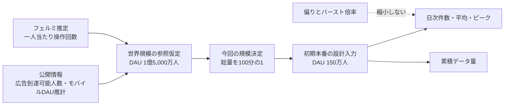
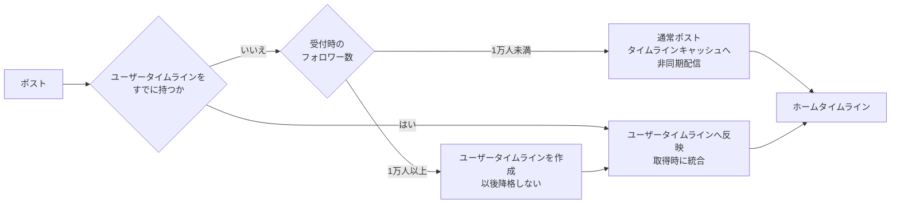

# 利用規模と負荷モデル

> 型: 利用・負荷モデル
> 読み手: 容量と配信方式の前提を判断するバックエンドエンジニア
> 更新日: 2026年9月16日

## 結論

今回の初期本番設計は、**日間利用者150万人**を対象とする。これはXの実測利用者数ではない。公開情報から置いた世界規模の日間利用者1億5,000万人という仮定を、実装期間と単一AlloyDBの制約に合わせて100分の1へ縮小した設計入力である。

初期本番で扱う設計基準は、ポスト50件/秒、ホームタイムライン取得3,500件/秒、フォロー変更2件/秒とする。短時間には、ポスト500件/秒、タイムライン取得3万件/秒、フォロー変更50件/秒まで到着し得ると仮定する。ピークを同期処理だけで処理し切るのではなく、通常ポストの配信をPub/Subへ滞留させて吸収する。

総量は世界規模仮定の100分の1にする。一方、通常ポストの平均配信先200人、フォロワー数の偏り、利用者単位の操作集中は100分の1にしない。これらを縮小すると、X型サービスで設計すべき読み取り偏重と一部利用者による負荷増幅が消えるためである。

キャッシュは、ホームタイムラインキャッシュと高ファンアウト投稿者ごとのユーザータイムラインキャッシュをそれぞれ最大500件保持する。ポスト本文はキャッシュせず、AlloyDBから取得する。500件は上限であり、フォロー解除後の件数不足を補充しない。キャッシュ全体が無い場合だけ、次の閲覧または高ファンアウトポストの配信時に原データから作り直す。これらは実測値ではなく、初期設計を進めるための合意済み仮定である。

## 採用値ができるまで

公開情報は、現在のXの世界利用量を直接確定できるものではなかった。このため、確認できた値をそのままMAUやDAUとして採用せず、設計に必要な桁を置く材料として使った。

DataReportalが示す5億8,600万人は、Xの広告到達可能人数である。MAUの実測値ではない。Similarwebによる1億3,200万人は、モバイルアプリの日間利用者の推計である。Web利用分を含まず、X自身が開示した全世界DAUでもない。

世界規模の参照値は、モバイル推計1億3,200万人へWeb利用分1,800万人を加えた1億5,000万人と仮定した。Web利用分は公開値から直接得たものではなく、桁を丸めるためのフェルミ推定である。この仮定の確度は中とする。

世界規模をそのまま初期構成の達成容量にすると、単一AlloyDBへ算定期間分のポストとフォロー関係を置く構成が成立しない。そこで今回の設計対象を100分の1の日間利用者150万人とした。この縮小率は利用者との合意であり、Xの市場占有率やサービス開始時の実績予測ではない。

## 今回採用する利用量

### 一日当たりの操作回数

一人当たりの操作回数は公開実測値を確認できなかったため、次のように仮定する。

- ポスト: 一人当たり2件/日
- ホームタイムライン取得: 一人当たり200回/日
- フォロー変更: 一人当たり0.1回/日

ホームタイムライン取得には、画面を開く操作、更新、ページング、再取得を含める。フォロー変更には、フォローとフォロー解除を含める。

日間利用者150万人へ掛けると、ポスト300万件/日、ホームタイムライン取得3億件/日、フォロー変更15万件/日になる。ホームタイムライン取得はポストの100倍である。

### 平均とピークを分ける

日次件数を86,400秒で割った値を算術平均とする。設計基準は、算術平均を下回らないよう安全側へ丸めた値である。1分ピークと1秒バーストは実測値ではなく、短時間集中を設計へ入れるための仮定である。

| 操作 | 日次件数 | 算術平均 | 設計基準 | 1分ピーク | 1秒バースト |
|---|---:|---:|---:|---:|---:|
| ポスト | 300万件 | 約35件/秒 | 50件/秒 | 150件/秒 | 500件/秒 |
| ホームタイムライン取得 | 3億件 | 約3,472件/秒 | 3,500件/秒 | 1万件/秒 | 3万件/秒 |
| フォロー変更 | 15万件 | 約1.74件/秒 | 2件/秒 | 10件/秒 | 50件/秒 |

ピーク値は、その値を常時処理するという意味ではない。API入口は短時間バーストを受ける。通常ポストのフォロワー向け配信は非同期化し、Pub/Subの滞留量と最古未確認メッセージ時間を見ながら後続処理する。

## 配信先数の偏りを残す

通常ポストの平均配信先を200人と仮定する。この値も実測ではない。世界規模から総量を100分の1へ縮小しても、利用者が持つフォロワー数を一律に100分の1にはしない。

設計基準のポスト50件/秒がすべて通常ポストなら、タイムラインキャッシュへの配置は最大約1万件/秒になる。1分ピークでは約3万件/秒、1秒バーストでは約10万件/秒に増幅する。実際には高ファンアウトポストを事前配信しないため、これらは通常配信経路の上限参考であり、実量ではない。

初めてユーザータイムラインを持つか判断する暫定境界は、ポスト受付時点のフォロワー1万人である。日間利用者150万人の構成では、10万人への一括配信は一ポストだけで通常時の配信処理を長時間占有し得る。1万人もAlloyDBの実測限界ではなく、安全側へ置いた設計値である。

投稿者が一度ユーザータイムラインを持った後は降格させず、以後のポストをすべてユーザータイムラインへ反映する。ポストごとの配信方式は受付時に固定し、過去ポストの経路は変更しない。通常ポストでも、境界直下の投稿者が配信処理を占有しないよう、配信チャンクと投稿者別処理予算を設ける。

投稿者が初めて高ファンアウト経路へ移行するときは、一度だけ大きなfanoutが起きる。投稿者を、全フォロワーの「読み取り時に合成する高ファンアウト投稿者」へ追加するためである。

判定時点のフォロワーは1万人以上である。フォロー変更がなければ、Redis更新も1万件以上になる。複数の投稿者が同時にこの境界へ達する可能性もある。この負荷は、通常配信の平均200人から求めた約1万配置/秒には含めない。

更新は現在のフォロワー行を利用者ID順に並べ、件数ができるだけ均等になる実在IDを境界として複数範囲へ分ける。UUIDの数値空間は等分しない。各範囲を最大500人のバッチとして進める。範囲どうしは並行処理でき、同じ範囲のバッチは逐次処理する。負荷試験では、同時に昇格する投稿者数、範囲数と同時実行数、Redis更新数、処理待ちの最長時間を測る。完了をポスト作成APIの成功条件にはしないが、バッチ完了、範囲完了、要求全体完了を記録し、処理対象と継続位置を失わない。

## 操作回数の集中はレート制限で扱う

操作回数の集中と、一ポストから生じる配信増幅は別の負荷である。レート制限はAPIの呼び出し回数を抑える。高ファンアウト判定は配信経路を分ける。ポスト頻度によって配信経路を動的に切り替えない。

利用者単位の暫定上限は次のとおりである。複数の時間窓を同時に適用する。

- ポスト作成: 5回/秒、60回/時、300回/日
- タイムライン閲覧（ユーザータイムライン取得とホームタイムライン取得の合計）: 10回/秒、120回/時
- フォローとフォロー解除の合計: 20回/分、100回/日

この数値は不正利用者を認定する基準ではない。利用者へ恒久的な属性を付けず、それぞれの時間窓で上限超過を判定する。

## 累積データ量

初期リリースではポストを削除せず、表示可否を経過時間で変えない。容量は算定期間を3年と仮定して見積もる。この3年は容量の算定期間であり、業務上の期限ではない。年間成長率は0%、1年は365日と仮定する。

次の値は、圧縮、PostgreSQLの行オーバーヘッド、索引、複製、バックアップを含まない論理量である。

| 対象 | 1件の仮定 | 算定期間の累積件数 | 論理量 |
|---|---:|---:|---:|
| ポストの一次データ `posts` | 1,024バイト | 32億8,500万件 | 約3.36TB |
| ポスト作成履歴 `post_created_events` | 1,024バイト | 32億8,500万件 | 約3.36TB |
| フォロー変更履歴 | 256バイト | 1億6,425万件 | 約42GB |
| タイムラインキャッシュへの配置（参考） | 32バイト | 常駐は利用者あたり最大500件 | AlloyDBには置かない |

タイムラインキャッシュはRedisに置き、利用者あたり最大500件で頭打ちになるため、累積対象にしない。上表だけでもAlloyDBの論理量は約6.76TBになる。これは既知の下限であり、`post_base_events`、全ポストに作るOutbox配信要求、投稿者別配信経路、フォローイベント発行要求、Outbox回収・発行完了、配信バッチ完了・範囲完了・要求全体完了、調停のlease取得・発行、フォロー変更反映完了をまだ含まない。初期リリースではこれらも削除も退避もしないため、すべて累積容量として別途見積もる必要がある。さらに、PostgreSQLの行オーバーヘッド、索引、複製、バックアップも含まない。旧モデルの約3.40TBはポスト本文が原データとイベント履歴に二重保存されることを数えておらず、現行モデルの容量入力として使わない。旧モデルで算入していたAlloyDB上のタイムラインキャッシュ約10.51TBと、その合計約13.92TBも現行値ではない。

停止した配信要求は、要求ごとの調停用派生状態と`pending`行だけの次回時刻索引から探す。全完了履歴を一件ずつ照合しない。進捗・調停・完了のイベント追加と同じトランザクションで派生状態も更新し、完了後も行を保持する。フォロワー範囲はフォロー中の`(followed_user_id, follower_user_id)`複合索引で走査する。記録一件の実測サイズと、一要求あたりの平均バッチ数・調停回数が未確定なため、技術記録の総容量は負荷試験と実装計測で確定する。

通常のポスト一件で5行（`posts`、`post_base_events`、`post_created_events`、Outbox配信要求、配信調停予定）を同期書き込みし、初めてユーザータイムライン経路へ移るポストでは投稿者別配信経路も同じトランザクションで追加する。設計基準50件/秒、1秒バースト500件/秒に対して単一PostgreSQLで処理できる範囲と判断し、初期リリースでは履歴と配信開始をポストと一緒に確定する。ポストトランザクションの遅延が目標を超えたと実測で分かったときに、履歴の非同期化を再検討する。

## 設計への引き継ぎ

このモデルから、初期設計には次を要求する。

- 読み取りがポストより100倍多い前提で、タイムラインキャッシュとキャッシュを主要経路にする
- 高ファンアウトポストを通常の事前配信から分離する
- 通常配信をチャンク化し、投稿者別の処理予算を設ける
- 1秒バーストを同期処理能力ではなくPub/Subの滞留で吸収する
- キャッシュミス時は一次データから再構築する
- 算定期間分の原データを単一AlloyDBの安全域と照合する

## キャッシュ容量の暫定仮定

ホームタイムラインキャッシュは、ポストIDと投稿者IDの組を新しい順に最大500件保持する。APIの1ページ50件とは分け、直近10ページ相当をRedisから返せる容量として扱う。キャッシュだけで要求ページを満たせない場合は、AlloyDBから表示資格のある古いポストを取得する。

ホームタイムラインキャッシュはポストIDを最大500件保持し、投稿者索引、フォロー関係版、高ファンアウト投稿者一覧、作り直し中の保留データを別のRedisキーで管理する。キーごとにZSET、Hash、Setなどの表現と管理領域が異なるため、ポストIDと投稿者IDの合計バイト数だけでは一利用者当たりの使用量を算定できない。キャッシュ用Redisは部分的なキーの退避を防ぐため`noeviction`とし、容量不足時の書き込み失敗を監視する。

必要容量は、利用者当たりのRedis実測使用量、キャッシュが存在する利用者数、高ファンアウト投稿者数、作り直し中の一時データ、断片化、複製の構成から決める。日間利用者数を全員分の常駐キー数と同一視しない。本文キャッシュは現行実装で採用せず、本文の取得負荷はAlloyDB側で測る。

閲覧時は、読み取り時に合成する高ファンアウト投稿者のユーザータイムラインキャッシュをRedisから読む。最大の5,000人がすべて高ファンアウト投稿者なら、参照するリスト値は次の規模になる。

- 設計基準の3,500取得/秒: 最大1,750万個/秒
- 1秒バーストの3万取得/秒: 最大1億5,000万個/秒

実際に何人が読み取り時に合成する高ファンアウト投稿者になるかは未計測である。返却件数を50件にしても、読み出すリスト数は減らない。

初期実装では、最大5,000人の高ファンアウト投稿者を黙って減らさない。Redisからは100キーずつ取得する。この件数は、一回の取得量とメモリ使用量を区切るための設定値であり、最大50回の取得を必ず直列に行うという意味ではない。複数の取得は上限付きで並行実行できる。各回で重複を除いた新しい側の最大51件だけを残す。全員を処理するため、5,000キーを一度に取得した場合と同じ一ページになる。並行数はRedis接続数、通信量、APIの一時メモリを負荷試験で測って決める。

一リクエストが使えるデータ量とメモリ量は制限する。APIインスタンス全体でも、同時に実行する合成数を制限する。安全上限を超えた要求は、部分結果を返さず過負荷エラーにする。具体値はAPI設計と負荷試験で決める。

負荷試験では、読み取り時に合成する高ファンアウト投稿者数、データ量、CPU、メモリ、ネットワークを測る。その結果から安全上限と、別索引へ移る条件を決める。

直近ページの表示対象と順序の決定は、キャッシュだけで一ページを満たせる場合にはRedisで完結する。キャッシュの終端付近や500件より古いページでは、AlloyDB読み取りプールから表示資格のあるポストを取得する。キャッシュ全体が無い場合はAlloyDBプライマリから同期的に直近最大500件を作り直す。件数不足や経過時間では作り直さないため、定期作り直しの負荷は発生しない。

負荷試験では、Redisの再起動やキャッシュ全体の欠損後に多数の利用者が同時に閲覧した場合の同期作り直し件数、1秒当たりの索引参照数、プライマリ使用率を測る。同じ利用者の作り直しは同時に一つだけ進める。

## 推定値の扱い

設計基準、ピーク倍率、平均配信先、1件当たりの論理量は実測値ではなく、初期実装を同じ規模で評価するための仮定である。性能保証として扱わない。ホームタイムラインとユーザータイムラインのキャッシュは、それぞれ最大500件とする。Redis容量は実測後に決める。

## 出典・引用

- DataReportal, [X Users, Stats, Data & Trends for 2025](https://datareportal.com/essential-x-stats), 2025年3月12日更新、2026年9月15日閲覧。広告到達可能人数5億8,600万人を世界規模の桁の参照に使った。MAUとしては採用していない。引用: “X ads reached 586 million users in January 2025.”
- Sarah Perez, TechCrunch, [Threads is nearing X’s daily app users, new data shows](https://techcrunch.com/2025/07/07/threads-is-nearing-xs-daily-app-users-new-data-shows/), 2025年7月7日、2026年9月15日閲覧。Similarwebによるモバイルの日間利用者推計を参照した。引用: “X reached 132 million daily actives.”
- X Corp., [Digital Services Act Transparency Report - April 2025 to June 2025](https://transparency.x.com/dsa-transparency-report-2025-october.html), 2026年9月15日閲覧。EUの月間アクティブ受領者であり、世界DAUの計算には使っていない。引用: “Average Monthly Active Recipients - 1 April to 30 June.”
- X Corp., [X follow limit and ratio](https://help.x.com/en/using-x/x-follow-limit), 2026年9月15日閲覧。初期の最大フォロー数5,000人を決める参考にした。

日間利用者へのWeb利用分1,800万人、一人当たりの操作回数、ピーク倍率、平均配信先200人、各データの論理サイズ、年間成長率0%は、この資料が設計比較のために置いた推定である。日間利用者150万人、高ファンアウト境界1万人、最大フォロー数5,000人、容量の算定期間3年、キャッシュの初期保持範囲は今回の合意事項である。
