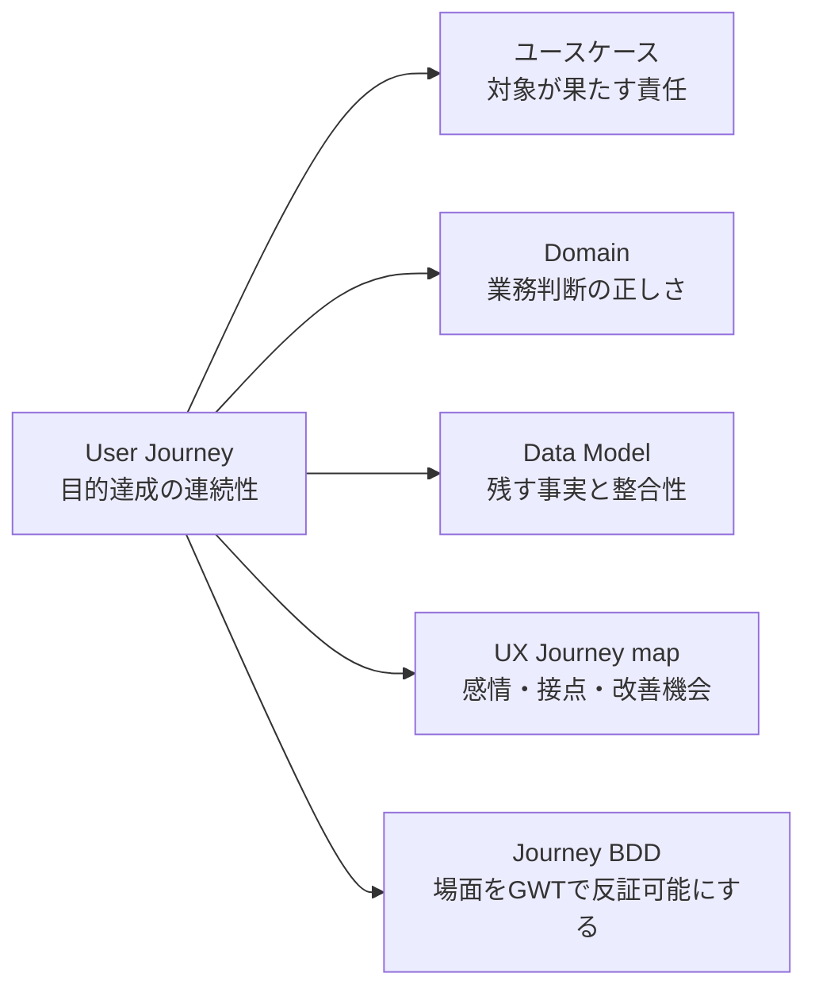

# 概念の関係

同じ題材から複数の正本が生まれても、答える問いは混ぜない。

```mermaid
flowchart LR
    J[User Journey\n目的達成の連続性] --> U[ユースケース\n対象が果たす責任]
    J --> D[Domain\n業務判断の正しさ]
    J --> M[Data Model\n残す事実と整合性]
    J --> X[UX Journey map\n感情・接点・改善機会]
    J --> B[Journey BDD\n場面をGWTで反証可能にする]
```

矢印は所有や工程順を意味しない。Journeyを読んだ結果、対象システムの責任、未確定の業務ルール、残すべき事実、UX上の課題、BDD化すべき場面が見つかり得ることを表す。

Journey mapはこれらの内容を複製しない。必要な正本を相対Markdownリンクで参照し、未確定なら送り先と確認相手を残す。
