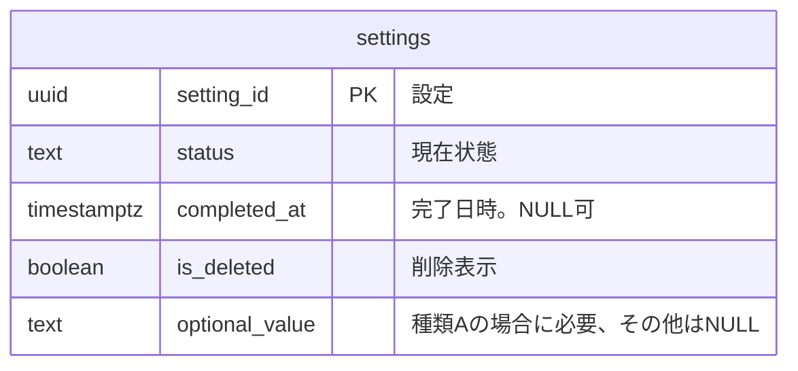

# RDB論理設計 — 設定

## リソース系とイベント系

| 系列 | 性質 | 論理テーブル | 保存表現 | 時刻 | 変化 | 根拠 |
|---|---|---|---|---|---|---|
| リソース系 | 業務 | `settings` | 現在状態 | なし | 更新あり | 設定の業務知識 |

## 論理データモデル図

## 論理テーブル定義

### `settings`（設定）

設定の現在状態。

## BDD
