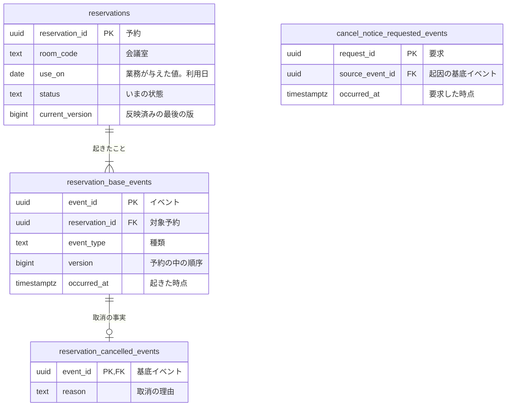

# RDB論理設計 — 予約

## リソース系とイベント系

| 系列 | 性質 | 論理テーブル | 正式な定義 | 時刻 | 変化 | 根拠 |
|---|---|---|---|---|---|---|
| リソース系 | 業務 | `reservations` | 現在状態 | なし | 更新あり | 予約の業務知識 |
| イベント系 | 業務 | `reservation_base_events` | イベント列 | `occurred_at` | 追加のみ | 予約の業務知識 |
| イベント系 | 業務 | `reservation_cancelled_events` | イベント列 | なし | 追加のみ | 予約取消の業務知識 |
| イベント系 | 技術 | `cancel_notice_requested_events` | イベント列 | `occurred_at` | 追加のみ | 取消を知らせる要求 |

## 論理データモデル図

## 論理テーブル定義

### `reservations`（予約）

予約を見分ける識別子と、予約したときに決まる会議室と利用日。

### `reservation_base_events`（予約に起きたこと）

予約に起きた出来事に共通する事実。

### `reservation_cancelled_events`（予約取消）

取消に固有の事実。

### `cancel_notice_requested_events`（取消の通知の要求）

取消を知らせる要求。

## BDD
