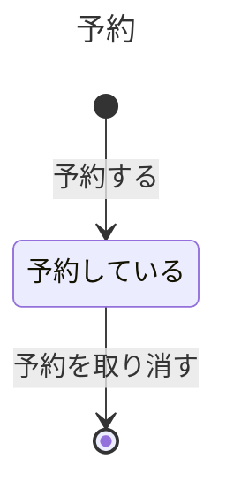

# 会議室の予約の業務知識

会議室を使いたい人が、使う日を決めて部屋を押さえる業務である。

# ユビキタス言語

| 業務の言葉 | 英名 | 種類 | 持ち主 |
|---|---|---|---|
| 予約 | Reservation | 業務用語 | この資料 |
| 予約した | Reserved | 業務イベント | この資料 |
| 予約を取り消した | ReservationCancelled | 業務イベント | この資料 |
| 予約する | Reserve | コマンド | この資料 |
| 予約を取り消す | CancelReservation | コマンド | この資料 |

# 状態と、その移り変わり

## 予約



# 業務の行い

## コマンド

### 予約を取り消す

予約した本人だけが取り消せる。

#### 拒む理由: 本人ではない

ほかの人の予定を勝手に消せてしまうからである。

#### 拒む理由: 利用日を過ぎている

使い終えた予約は取り消す意味が無いからである。

# BDD

### [BDD-001] 本人は利用日の前に予約を取り消せる

```gherkin
Given: 利用者Aが2026年10月1日の会議室Rを予約している
When: 利用者Aが2026年9月30日に予約を取り消す
Then: 予約は取り消される
```

### [BDD-002] ほかの人の予約は取り消せない

```gherkin
Given: 利用者Aが2026年10月1日の会議室Rを予約している
When: 利用者Bがその予約を取り消す
Then: 取消は拒まれる
  NOTE: Rule: 本人ではない
    Reason: 予約した本人ではない
```
