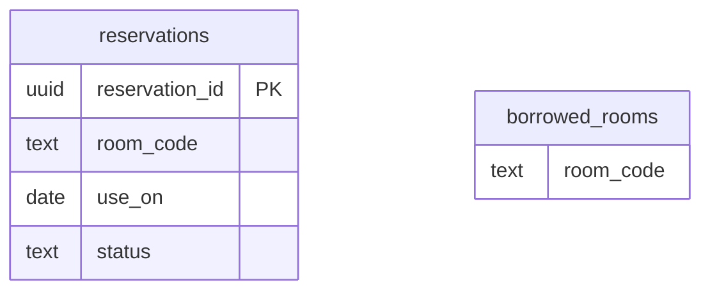

# 予約のコマンドデータモデル

| 系列 | 性質 | 論理テーブル | 表すもの | 時刻 | 変化 | 根拠 |
|---|---|---|---|---|---|---|
| リソース系 | 業務 | `reservations` | 現在状態 | 利用日 | 追加 | 予約 |

### `reservations`（予約）

予約の一行を定義する。

### `borrowed_rooms`（参照する部屋）

部屋は別の資料が定義する。
