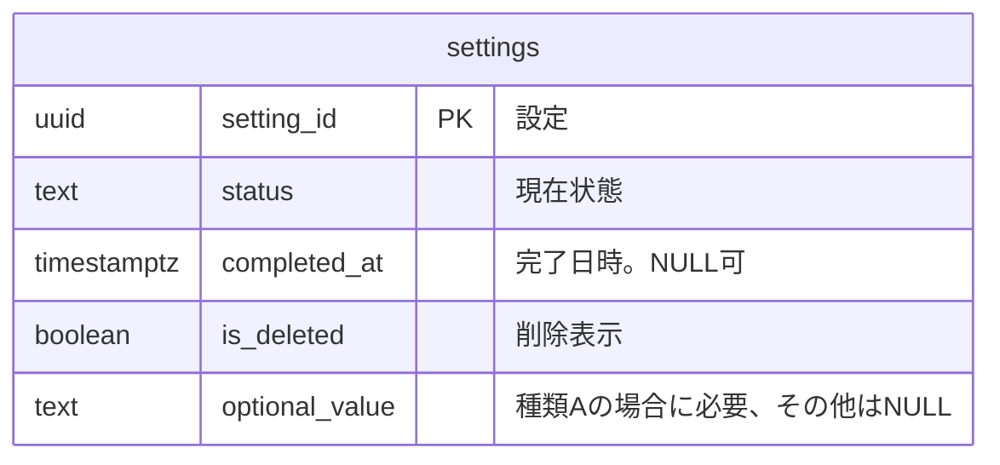

# 設定のコマンドデータモデル

## リソース系とイベント系

| 系列 | 性質 | 論理テーブル | 保存表現 | 根拠 |
|---|---|---|---|---|
| リソース系 | 業務 | `settings` | 現在状態 | 設定の業務知識 |

## データモデル図

## テーブル定義

### `settings`（設定）

設定の現在状態。

## BDD

## 業務知識のBDDとの対応

| 業務知識のBDD | この資料のBDD |
|---|---|
| BDD-001 | 対象外 |
| BDD-002 | クエリデータモデル |

BDD-001 は保存の前に拒まれて記録に届かない。
