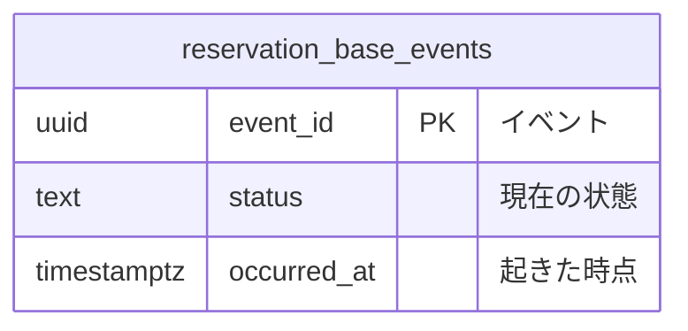

# 予約のコマンドデータモデル

## リソース系とイベント系

| 系列 | 性質 | 論理テーブル | 保存表現 | 時刻 | 変化 | 根拠 |
|---|---|---|---|---|---|---|
| イベント系 | 業務 | `reservation_base_events` | イベント列 | `occurred_at` | 更新あり | 予約の業務知識 |

## データモデル図

## テーブル定義

### `reservation_base_events`（予約イベント）

予約に起きた出来事。

## BDD
