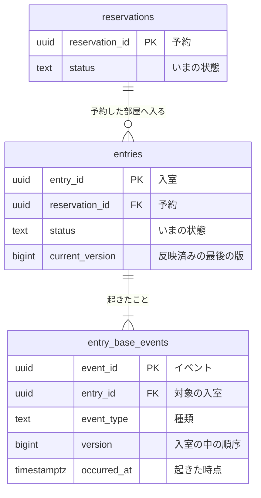

# 入室のコマンドデータモデル

## 残す事実

| 系列 | 性質 | 論理テーブル | 保存表現 | 時刻 | 変化 | 根拠 |
|---|---|---|---|---|---|---|
| リソース系 | 業務 | `entries` | 現在状態 | なし | 更新あり | 入室の業務知識 |
| イベント系 | 業務 | `entry_base_events` | イベント列 | `occurred_at` | 追加のみ | 入室の業務知識 |

## 読むだけのテーブル

| 参照するテーブル | 読む列 | 持ち主の資料 |
|---|---|---|
| `reservations` | `reservation_id`、`status` | [予約のコマンドデータモデル](valid.md) |

## 図

## 定義

### `entries`（入室）

予約した部屋へ入ったこと。

### `entry_base_events`（入室に起きたこと）

入室に起きた出来事に共通する事実。
