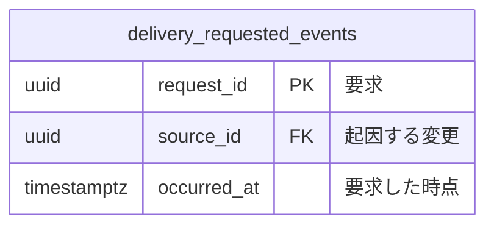

# 後続処理のコマンドデータモデル

品質要求と起因する変更契約に基づき、要求を確定した事実を残す。

| 系列 | 性質 | 論理テーブル | 保存表現 | 根拠 |
|---|---|---|---|---|
| イベント系 | 技術 | `delivery_requested_events` | イベント列 | 後続処理を失わない品質要求 |



### `delivery_requested_events`（後続処理の要求）

一行は起因する変更と同時に確定した処理要求を表す。

### [BDD-001] 変更と要求を同時に確定する

```gherkin
Given: 起因する変更が未確定
When: 変更が成立する
Then: 要求の行も同時に増える
```
