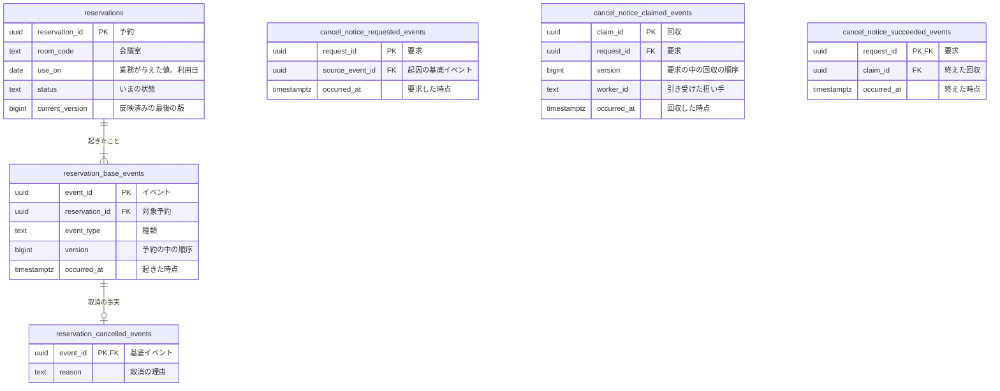

# 予約のコマンドデータモデル

## リソース系とイベント系

| 系列 | 性質 | 論理テーブル | 保存表現 | 根拠 |
|---|---|---|---|---|
| リソース系 | 業務 | `reservations` | 現在状態 | 予約の業務知識 |
| イベント系 | 業務 | `reservation_base_events` | イベント列 | 予約の業務知識 |
| イベント系 | 業務 | `reservation_cancelled_events` | イベント列 | 予約取消の業務知識 |
| イベント系 | 技術 | `cancel_notice_requested_events` | イベント列 | 取消を知らせる要求 |
| イベント系 | 技術 | `cancel_notice_claimed_events` | イベント列 | 取消を知らせる要求 |
| イベント系 | 技術 | `cancel_notice_succeeded_events` | イベント列 | 取消を知らせる要求 |

## データモデル図

## テーブル定義

### `reservations`（予約）

予約を見分ける識別子と、予約したときに決まる会議室と利用日。

### `reservation_base_events`（予約に起きたこと）

予約に起きた出来事に共通する事実。

### `reservation_cancelled_events`（予約取消）

取消に固有の事実。

### `cancel_notice_requested_events`（取消の通知の要求）

取消を知らせる要求。

### `cancel_notice_claimed_events`（取消の通知の回収）

担い手が要求を引き受けた事実。

### `cancel_notice_succeeded_events`（取消の通知の成功）

知らせ終えた事実。

## BDD

## 業務知識のBDDとの対応

| 業務知識のBDD | この資料のBDD |
|---|---|
| BDD-001 | 対象外 |
| BDD-002 | クエリデータモデル |

BDD-001 は保存の前に拒まれて記録に届かない。
